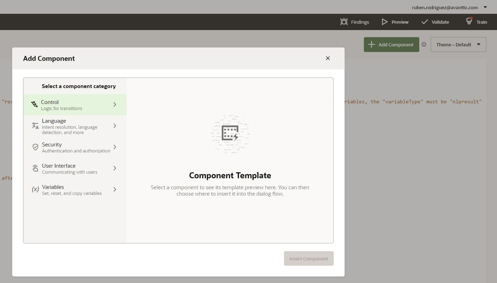
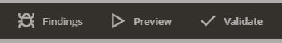
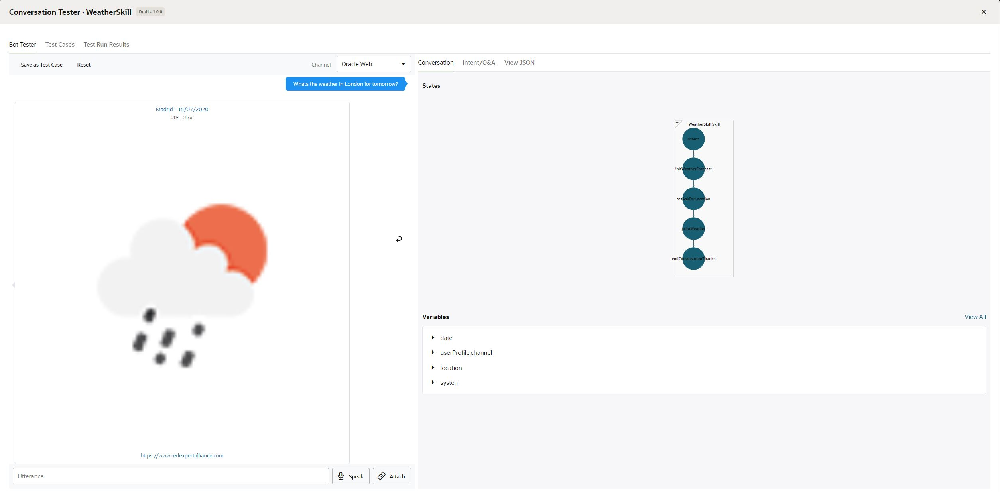

# Variables in LiveLabs

## Introduction

The next step after creating the intents is to implement the dialog flow, well not really, as you will need to define the dialog flow in advance of the implementation but it is for this hands-on.

As it was mentioned in the previous lab, the dialog flow in Oracle Digital Assistance is implemented in YAML, you will be defining a set of states and transitions among them.
Everything is a state, starting sith the intent resolution and ending with the calls to external sources via custom components.

In this lab you will implement the dialog flow for your skill and, as you have not implemented the REST call to OpenWeatherMap API, you will just set static data as response to the user requests.

## Task 1: Add an intent state to you flow

Click on the Flows menu.

First of all, theres a button '+ Components' where you have code snippets for all the components you can add to the flow. This provides a baseline for the states you want to add, meaning you dont need to write every single like of code.

By default, the flow is initializated with an example. You can delete all the lines below 'states:' (in line 24) because you will be adding and understanding new code.

As you can see, YAML has 2 spaces indent. In the flow editor, you can tab and the cursor will move two spaces to the right.

Just below 'states:', andd the following code.

<pre>
    <code>
  intent:
    component: "System.Intent"
    properties:
      variable: "iResult"
    transitions:
      actions:
        Greetings: "greet"
        WeatherForecast: "initWeatherForecast"
        Help: "help"
        unresolvedIntent: "unresolved"
    </code>
</pre>

The 'intent' state is using a 'System.Intent' component. This component is the one that triggers the Intent resolution.

The variable iResult, thas is already defined in to top part of the flow of type 'nlpresult', is where the Intent resolution data is stored.

The transitions property is included in every single state and enables you to make the transition to other states. For example, in this case, if the intent matched is 'Greetings', the next state that will be executed is 'greet' state. The same with 'WeatherForecast' intent and 'initWeatherForecast' state.

You can have different types of transitions depending on the component:
  * next: The state specified is the next to be executed.
  * actions: Depending on the action one state will be executed.
  * return: Ends the conversation. All variable values are cleared unless those are stored in the user variable.
  * error: If there is an error on the state, it will transition to the specified state.

It is recommended that every state has a transition defined, but it is not mandatory. If you dont define it, the state execution order is top-bottom.

## Task 2: Asking for input and sending messages

Now that the intent state is done, you will start adding states for 'Greetings', 'Help' and 'unresolvedIntent' intents.
The 'unresolvedIntent' is executed when the minimum confidence percentage is not reached by any of the defined intents.

Add this code at the end of the existing code.. Take care of the indents of the code!

<pre>
    <code>
    greet:
      component: "System.Output"
      properties:
        text: "Welcome to the Weather Forecast Assistant!"
        keepTurn: true
      transitions:
        next: "help"

    help:
      component: "System.Output"
      properties:
        text: "I can help you with the weather forecast for the next 7 days. Try to ask for a Location and a day."
      transitions:
        return: "done"
    </code>
</pre>

Both states are 'System.Output' components. This component prints a text to the end user.
Something to take into account is that we are using keepTurn property on 'greet' state. By default, after the execution of a state it waits for user input to execute the next one. By setting keepTurn to true, we make it not to wait, hence the next state 'help' is executed.

Now we you will take care of the 'unresolvedIntent' states. Copy and add this code at the end of the existing code.
<pre>
    <code>
  unresolved:
    component: "System.List"
    properties:
      prompt: "I'm sorry but I cannot help you with that! Do you want to know the weather forecast?"
      options: "Yes, No"
    transitions:
      actions:
        Yes: "initWeatherForecast"
        No: "endUnresolved"
    
  endUnresolved:
    component: "System.Output"
    properties:
      text: "I'm sorry to hear that. Please come back once you need to know more about the weather forecast!"
    transitions:
      return: "done"
    </code>
</pre>

The first state executed when no Intent has been matched is executing a 'System.List' component on the 'unresolved' state. The user will be prompted to select one of the different options. In this case we are enforcing the user to select Yes or No to the question defined in the prompt property.

If the user selects No, the next state to be executed will be 'endUnresolved', that will just say goodbye to the user. On the other hand, if the user selects Yes, it will transition to the main part of the dialogflow that is the request of the weather entities.

As you can see, you are using a 'return' transition on the 'endUnresolved' state, meaning the conversation will end there, and the next time the user message the bot, the conversation will start from the begining.

## Task 3: Using variables in the dialog flow implementation

Now you will start implementing the main part of the dialog flow, the weather forecast request from the user.

First, you need to define two variables. This can be done in the top part of the code, under context variables.
Check your code so it looks like the following.
<pre>
    <code>
context:
  variables:
    location: "LOCATION"
    date: "DATE"
    iResult: "nlpresult"
    </code>
</pre>
Add the following code at the end of the existing code.
<pre>
    <code>
  initWeatherForecast:
    component: "System.SetVariable"
    properties:
      variable: "date"
      value: "${iResult.value.entityMatches['DATE'][0]}"
    transitions:
      next: "setAskForLocation"

  setAskForLocation:
    component: "System.Text"
    properties:
      prompt: "Please let me know what city do you want to search for"
      variable: "location"
      maxPrompts: 2
      nlpResultVariable: "iResult"      
    transitions:
      next: "printWeather"
      actions:
        cancel: "noLocation"

  noLocation:
    component: "System.Output"
    properties:
      text: "I need a location to provide the weather. Please type for example 'What's the weather in London'"
    transitions:
      return: "done"
    </code>
</pre>

The first state executed is 'initWeatherForecast'. You are using a 'System.SetVariable' component to store in 'date' variable the date provided by the user on the initial request. It doesnt matter if it exists or not inside the 'iResult' variable, it will transition to 'setAskForLocation' state.

In the second state, you are using a 'System.Text' component, that allows you to ask the user for  the location if it is not stored in 'location' variable. There are some things to keep in mind here:
* Some states, including the ones using 'System.Text' components, will only be executed if the variable defined in the variable property is not set. This is called entity slotting.
* By setting the property 'nlpResultVariable', you are trying to set the value from the intent resolution before checking if the value exists.
* maxPrompts value defines the number of times the user will be prompted for the location. In this case only twice, and after the second time it will navigate to the state defined in the 'cancel' action of the transitions.
If the user provided a location in their initial request or it has been provided on this state execution, it will transition to 'printWeather' state.

The last state of this piece of code is 'noLocation'. Here you are just sending a message reminding the user that a location is needed and ending the conversation.

## Task 4: Using CommonResponse component for advanced formatting

The last part of the implementation is to actually print the weather to the user.
You will use a "System.CommonResponse" component for it. This is a very powerful component that enabled you to display cards (on channel that support it), send attachments such as image or video, and send the location of the user.

In this case you will use it to display the information as a card.
<pre>
    <code>
  printWeather:
    component: "System.CommonResponse"
    properties:
      keepTurn: true
      processUserMessage: false
      metadata: 
        responseItems:         
        - type: "cards" 
          cardLayout: "vertical"
          cards:
          - title: "Madrid - 15/07/2020"
            description: "20º - Clear"
            imageUrl: "http://openweathermap.org/img/wn/10d@2x.png"
            cardUrl: "https://www.redexpertalliance.com" 
    transitions:
      next: "endConversationThanks"
    </code>
</pre>
<pre>
    <code>
  endConversationThanks:
    component: "System.Output"
    properties:
      text: "Thanks for using my services. Feel free to ask me again before leaving your home!"
    transitions:
      return: "done"
    </code>
</pre>
Not much to say about it at the moment, type property under responseItems defines the type of the component (cards, atachment...) and then under cards property you are setting the values for the different facets of the card. 
The same way you used keepTurn in previous steps, it can be used on 'System.CommonResponse' component but, in this case, you need to set to false 'processUserMessage' property.

## Task 5: Testing your dialog flow

Implementation has been finished! Now it is time to test what you have implemented.

As you can see in the image below, theres three buttons.
* The bug button displays the rror that you might have in your flow definition.
* The play button opens a conversation tester.
* The 'Validate' button validates your flow definiton.

Feel free to click on 'Validate' to ensure that your flow does not have any error. 
Once it is validated, you can click on the play button.

On the left-hand side you can have a conversation with the bot, and on the right-hand side you have some information that let you debug your flow such as variable values, states history, etc.

You can try to play with it using different phrases, for example, the ones you used in the previous lab.

| Phrases                                   |
| ------------------------------------------|
| What's the weather like?                  |
| is it snowing in Madrid?                  |
| Whats the weather in London for tomorrow? |

## Summary

You have learned how to implement the dialog flow of your skill using some of the built-in components such as Intent, List and CommonResponse.

If you have missed something or the code is not working, you can get the full flow definition in the following link: [Lab 3 Flow Definition](https://github.com/rsantrod/katacoda-scenarios/blob/master/oda-course/oda03-skill-flow-implementation/images/flow.yaml)

In the next lab you will be implementing you own Custom Component and integrating it in the dialog flow.

### Resources

[Oracle Digital Assistant - The Dialog Flow Definition](https://docs.cloud.oracle.com/en-us/iaas/digital-assistant/doc/dialog-flow-definition.html)

[Oracle Digital Assistant Enablement documentation](http://bit.ly/ODAEnablement)
