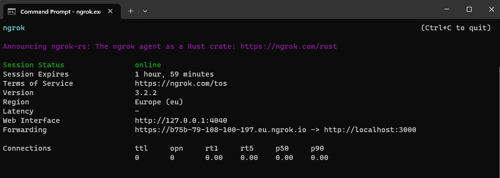
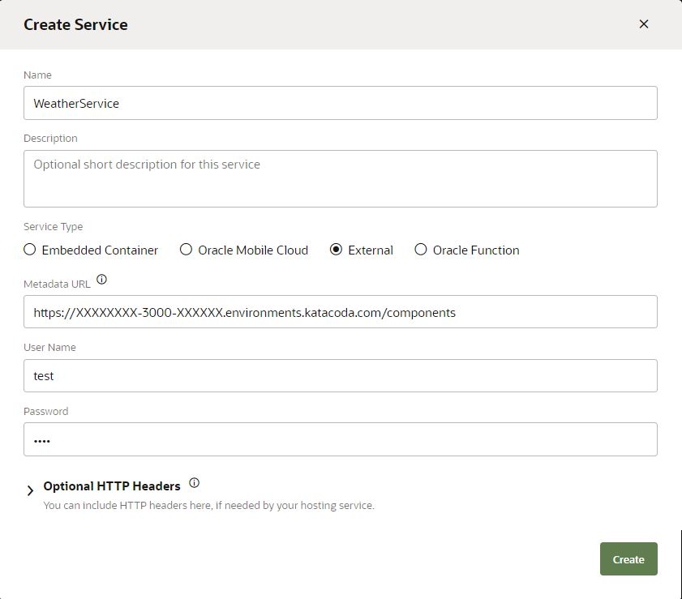
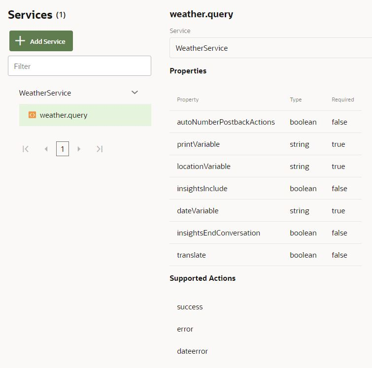

# Lab 4: Custom Components implementation to access external data sources

## Introduction

In this lab you will be consuming an external REST service to retrieve weather information.
In Oracle Digital Assistan this can be achieved by creating a Custom Component using the SDK provided and a couple of Node.js modules.

This is the first lab of the Oracle Digital Assistant series where you will be using the terminal and VSCode within Katacoda.

There are two prerequisites for this lab:
* You have to create a free account on [OpenWeatherMap API](https://openweathermap.org/) and get a API Key.
* You need a IDE such as Visual Studio Code (VSCode).

## Chatch up (optional):

I you had problems with the previous lab, you can download the working skill that can be imported into Oracle Digital Assistant here: https://github.com/rsantrod/katacoda-scenarios/blob/master/oda-course-redwood/oda04-skill-custom-components/images/WeatherSkill(1.0).zip

First make sure to remove the previous skill

Then click on import and select the downloaded file!

## Task 1: Setting up the environment

First of all you need to install node.js if you don't have it. You can download it in the followeing link: [Node.js](https://nodejs.org/en)

Then you need to install Oracle Digital Assistant node sdk. Open a Command Prompt or a Terminal and execute the follwing commands. 

<pre>npm install -g @oracle/bots-node-sdk</pre>

Now you can create the folder for our component.

<pre>mkdir weather-component</pre>

And go to that folder.

<pre>cd weather-component</pre>

Then you need to initialize our component. As it is a node.js application, you need to create package.json file.
'-y' options means no questions are asked and the file is created with default values (Just for the hands-on, in your real projects you will assign the right values)

<pre>npm init -y</pre>

Then you need to configure the SDK into our project.

<pre>bots-node-sdk init</pre>

Request module will enable you to make service calls. THis module is deprecated and for production usage you should consider other modules like https (part of Node code), Axios or Alike.

<pre>npm install --save request</pre>

You also need to install moment js module to easily display the date provided by the user in a specific format.

<pre>npm install --save moment</pre>

## Task 2: Custom Component structure, properties and variables

Great! All the configurations have been made and now you are ready for the implementation!
You will be copying and understanding the code behind the implementation.

In VSCode, under 'weather-component' folder, open up 'components' folder. In this folder is where you can can create your components.
By default, there's an example component, 'hellow.world.js', that you can use as a baseline for your new components.

For this workshop, we will start the component from scratch, so delete it.

Now you have to create a new file by right-clicking 'components' folder and selection 'New File'. Name it 'query.js'

Copy and paste the following code in 'query.js' file.
<pre>
  <code>
  'use strict';
  module.exports = {
    metadata: () => ({
      name: 'weather.query',
      properties: {
        locationVariable: { required: true, type: 'string' },
        dateVariable: { required: true, type: 'string' },
        printVariable: { required: true, type: 'string' }
      },
      supportedActions: ['success', 'error', 'dateerror']
    }),
    invoke: (conversation, done) => {

    }
  };
  </code>
</pre>

Metadata help you to define your custom component. In this case you will have three parameters:
  * locationVariable: The location provided by the user.
  * dateVariable: The date provided by the user.
  * printVariable: You will be storing here the data that will be returned to the user.

You can pass any value from the dialog flow to the component. What I like to do is not passing the value directly to the component, but the variable anem that hold the value. Doing this you prevent any change in the variable names to impact on your custom component execution.

You will have three actions as well:
  * success: Everyhing worked fine and the REST service has been called successfully.
  * dateerror: The date is not within the 7 days range that the service provides (for free).
  * error: Any other error will transition with this action.

Actions define the possible outcomes of the component, and it can be defined in the dialog flowunder transitions property as you learned in the previous scenario.

Next, you will be retrieving the properties and the variable values.
Add the following code inside 'invoke' function.

<pre>
    <code>
    const { locationVariable } = conversation.properties();
    const { dateVariable } = conversation.properties();
    const { printVariable } = conversation.properties();
    var location = conversation.variable(locationVariable);
    var date = conversation.variable(dateVariable);
    </code>
</pre>

'conversation.properties()' enables you to retrieve the different properties defined in the component.
'conversation.variable("variable_name")' and 'conversation.variable("variable_name", value)' enables you to set a variable.

## Task 3: Implementing the API calls

Now you will create two Promises containing each one a REST call to OpenWeatherMap API.

Copy and paste the following code below 'use strict'; at the begining of the file.
You have to replace 'your_api_key' with the API KEY you got from OpenWeatherMap.
<pre>
    <code>
    var request = require('request');
    var openweather_api_key = "your_api_key";
    var moment = require('moment');
    </code>
</pre>
Add the following code to the end of the file, outside 'module.exports' block.
<pre>
    <code>
	var currentWeather = function(location){
	  return new Promise(function(resolve, reject){
		request('http://api.openweathermap.org/data/2.5/weather?q='+location.name+'&units=metric&appid='+openweather_api_key, { json: true }, (err, res, body) => {
		  if(err){
			reject(err);
		  }else{
			resolve(body);
		  }
		});
	  });
	}
	var sevenDaysForecast = function(lat, lon){
	  return new Promise(function(resolve, reject){
		request('https://api.openweathermap.org/data/2.5/onecall?lat='+lat+'&lon='+lon+'&exclude=current,minutely,hourly&units=metric&appid='+openweather_api_key, { json: true }, (err, res, body) => {
		  if(err){
			reject(err);
		  }else{
			resolve(body);
		  }
		});
	  });
	}
    </code>
</pre>
The first function, 'currentWeather' is calling Current Weather Data API. With this API you have different ways of providing the location as a query parameter such as latitude/longitude, ZIP code, City Name, etc.
For this hands-on you will be passing the location name. 
'units=metric' will set the weather info into Celsius. YOu can remove it if you want to temperature to be in Kelvin, or set metric to Imperial if you want Fahrenheit.

The second function 'sevenDaysForecast' will call the One Call API. THis API cam return 7-days of weather forecast. You can only provide latitude and longitude to query this service. 

## Task 4: Adding the business logic

Now that the services call are implemented, it is time to beging the business logic implementation.

Using the free services the bot will allow the users to ask the weather forecast for any date within the next seven days.
One Call API already returns 7 days information (including current weather information), but as it requires latitude and longitude, and this is something you don't have at the moment, the component will be calling Current Weather API first to retrive current weather if the user requests today's weather or the coordinates if the user select another day.

It is not mandatory for the user to provide a date, so if no date is provided the componen will just retrive today's weather information.

Copy and paste the following code below the varible within the 'invoke' function.

<pre>
    <code>
    var day = 0;
    var today = new Date();
    const now = today.getTime();
    if(date){
      const diffTime = Math.abs(date.date - now);
      day = Math.ceil(diffTime / (1000 &#42; 60 &#42; 60 &#42; 24));
      if(day > 7){
          conversation.transition("dateerror");
          done();
          return;
      }
    }
    currentWeather(location).then(function(result){
      if(!date || day == 0){
        var printData = {
          "temp": result.main.temp,
          "weather": result.weather[0].main,
          "icon": "http://openweathermap.org/img/wn/"+result.weather[0].icon+"@2x.png",
          "date": moment().format('DD/MM/YYYY')
        };
        return printData;
      }else{
        return sevenDaysForecast(result.coord.lat, result.coord.lon).then(function(forecastResult){
          var newDate = new Date(today.getTime());
          newDate.setDate(newDate.getDate()+day);
          var printData = {
            "temp": forecastResult.daily[day].temp.day,
            "weather": forecastResult.daily[day].weather[0].main,
            "icon": "http://openweathermap.org/img/wn/"+forecastResult.daily[day].weather[0].icon+"@2x.png",
            "date": moment(newDate).format('DD/MM/YYYY')
          };
          return printData;
        }).catch(function(err){
          conversation.transition("error");
          done();
        });
      }
    }).then(function(printData){
      var printArray = new Array();
      printArray.push(printData);
      conversation.variable(printVariable, printArray);
      conversation.transition("success");
      done();
    }).catch(function(err){
      conversation.transition("error");
      done();
    });
    </code>
</pre>

In the first part of the code, you are just setting a few variables to be used later.
  * day variable will store the number of days from today, being today 0, tomorrow 1, etc. It will be used to get the specific position in the One Call API response.
  * today and now will be used to calculate the number of days from the user requests to today.

The next part is checking if the date exists and checking the day difference between that date and today.
If the day difference is greater than 7, the component will transition to 'dateerror' action by using conversation.transtition().

After that, the first promise is being called to retrieve the current weather. If the date was not provided or the day difference is 0, the data is returned, otherwise the second promise is executed.

## Task 5: Running the service and configuring it in Oracle Digital Assistant

The implementation is now finished and you are ready to execute the service so it can be consumed from the dialogflow.
You will start the service in your computer by using:

<pre>bots-node-sdk service -P 3000</pre>

Now that you have the service up and running, you have to expose the service using ngrok, otherwise it would be available only in your machine.
You can download ngrok in the following link: [Download ngrok](https://ngrok.com)

Open a terminal an execute:

<pre>ngrok http 3000</pre>

Once you execute that command you will find the following information.
Ngrok exposes your port 3000 and it becames accesible via the url, in my example, https://b75b-79-108-100-197.eu.ngrok.io. but you will get your own URL when running it.

Now it is time to go back to Oracle Digital Assistant.
Inside of your Weather Skill, click on the  Components menu.

Click on '+ Service' button and the following dialgo will appear.

There are different ways of running custom components in ODA.
  * Embedded Container: You can upload the package to ODA.
  * Oracle Mobile Cloud: Stablish a connection with Oracle Mobile Hub.
  * External: You can connect to the component deployed in an external system. 

In this case you will be using External as the service is running in your computer.
Fill the dialog with the values below:
  * Name: WeatherService
  * Metadata URL: [your-ngrok-url]/components
  * User Name: test
  * Password: test

It is mandatory to provide user name and password although you have not define one in your custom component.

The service is now created. If you make changes in the component definition, you will need to click on 'Reload' so the information is updated in ODA.

If you click on you component, 'weather.query' you will see the properties and actions defined.

## Task 6: Integrating the service call in the dialog flow implementation

The last step is to modify three states, add a new variable and a new state in the dialog flow to integrate the custom component.

You need a new state to actually call the custom component. As you can see the properties and transition actions matches the ones defined in the custom component.
<pre>
    <code>
  queryWeather:
    component: "weather.query"
    properties:
      locationVariable: "location"
      dateVariable: "date"
      printVariable: "weather"
    transitions:
      actions:
        success: "printWeather"
        dateerror: "showDateError"  
    </code>
</pre>
As you are using 'weather' variable in the component, you have to define it. Add the following code on the variables peroperty under context on the top part of the dialog flow.
<pre>
    <code>
    weather: "string"
    </code>
</pre>
In 'setAskForLocation' statem you need to set next transition to 'queryWeather' state so the custom component can be executed.
<pre>
    <code>
  setAskForLocation:
    component: "System.Text"
    properties:
      prompt: "Please let me know what city do you want to search for"
      variable: "location"
      maxPrompts: 2
      nlpResultVariable: "iResult"      
    transitions:
      next: "queryWeather"
      actions:
        cancel: "noLocation"    
    </code>
</pre>
Next, you have to change the cards values in 'printWeather' state it actually prints the returned data instead of the dummy.
<pre>
    <code>
  printWeather:
    component: "System.CommonResponse"
    properties:
      processUserMessage: false
      keepTurn: true
      metadata: 
        responseItems:         
        - type: "cards" 
          cardLayout: "vertical"
          cards:
          - title: "${location.value.name?capitalize} - ${weather.date}"
            description: "${weather.temp?round}º -  ${weather.weather}"
            imageUrl: "${weather.icon}"
            cardUrl: "https://www.redexpertalliance.com" 
            iteratorVariable: "weather"
    transitions:
      next: "endConversationThanks"
    </code>
</pre>
You can use Apache Freemaker expresions within the dialog flow.
In this case you are using 'location.value.name?capitalize' to make the first letter in uppercase, and 'weather.temp?round' to round the degrees and remove decimals.

The last thing to add is a new state to navigate for 'dateeror' transition.
<pre>
    <code>
  showDateError:
    component: "System.Output"
    properties:
      text: "I'm sorry but none can see that far away! I can only let you know the weather for the next seven days! Please try again!"
    transitions:
      return: "done"  
    </code>
</pre>

## Task 7: Testing 

The skill implementation is now completed and you can now test it!

Click Verify button to check that everything is working fine and then click on the 'Play' button to open up the tester.

In the image above you can see, on the right-hand side that the different states the flow has executed includes 'printWeather', your custom component.
If you check bellow, in the variables list, under weather array, the first position has the data to be printed.

&nbsp;
&nbsp;
&nbsp;
&nbsp;

If you have missed something or the code is not working, you can get the full flow definition in the following link: [Scenario 4 Flow Definition](https://github.com/rsantrod/katacoda-scenarios/blob/master/oda-course/oda04-skill-custom-components/images/flow.yaml)

&nbsp;
&nbsp;

And the working custom component code can be found in this link: [Scenario 4 Custom Component](https://github.com/rsantrod/katacoda-oda-weather-component)

&nbsp;
&nbsp;

## Summary

Integration is key for any chatbot to provide the right information to the users or just to execute any transactional process of the enterprises.

In this scenario you have created your own Custom Component that is calling a REST API by using Node.js modules. 
One of the advantages of implementing the components in node.js here are a lot of modules that helps you solve common problems  

In the next, and last, scenario, you will use Oracle JavaScript SDK to expose your skill in a web site.

### Resources

[Oracle Digital Assistant - Backend Integration](https://docs.cloud.oracle.com/en-us/iaas/digital-assistant/doc/backend-integration1.html)

[Oracle Digital Assistant Enablement documentation](http://bit.ly/ODAEnablement)
